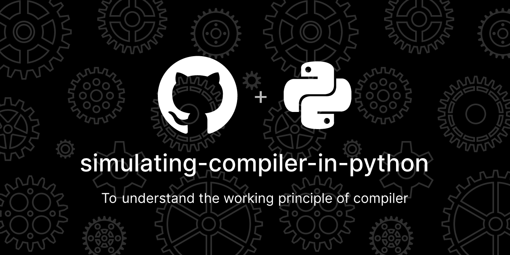

# 
Decoding the Mechanics of a Compiler and Its Components: A Comprehensive Overview

To simulate and understand the working principle of compiler and its functionalities.

1. To perform Lexical Analysis for a source program. ( Python ) [click here](https://github.com/mahimairaja/simulating-compiler-in-python/blob/main/1-token-separation.py)

2. To generate symbol table for given statement or function call. ( Python ) [click here](https://github.com/mahimairaja/simulating-compiler-in-python/blob/main/2-symbol-table-gen.py)

3. To simulate micro-processor ( Python ) [click here](https://github.com/mahimairaja/simulating-compiler-in-python/blob/main/3-macro-processor.py)

4. To perform Lexical Analysis for a source program. ( LEX ) [click here](https://github.com/mahimairaja/simulating-compiler-in-python/blob/main/4-token-separation.l)

5. To simulate single pass assembler - generate object program code ( Python ) [click here](https://github.com/mahimairaja/simulating-compiler-in-python/blob/main/5-single-pass-assem.py)

6. To simulate Deterministic Finite Automata ( Python ) [click here](https://github.com/mahimairaja/simulating-compiler-in-python/blob/main/6-dfa.py)

7. To simulate Predictive Parsing ( Python ) [click here](https://github.com/mahimairaja/simulating-compiler-in-python/blob/main/7-predictive-parsing.py)

8. To simulate Absolute Loader ( Python ) [click here](https://github.com/mahimairaja/simulating-compiler-in-python/blob/main/8-absolute-loader.py)

9. To Perform basic arithmetic operations ( YACC ) [click here](https://github.com/mahimairaja/simulating-compiler-in-python/blob/main/9-arithmetic-opr.y)

10. To generate three address code - Intermediate Code ( Python ) [click here](https://github.com/mahimairaja/simulating-compiler-in-python/blob/main/10-intermediate-code.py)

---

Hope the above code helped you to understand the working mechanism of a compiler and its componunds. Feel free to reach out for any doubts. 

## 📝 License 

This project is licensed under the **MIT License**. See the [LICENSE](LICENSE) file for details.Thank you for respecting the `licensing terms` and providing proper attribution when using this code! :tada: